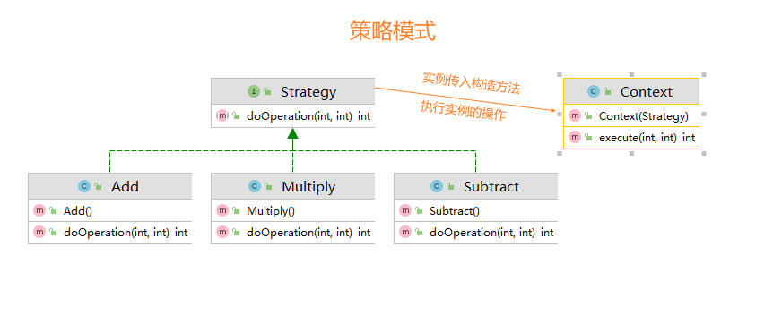

# 工程简介
> 在策略模式:一个类的行为或其算法可以在运行时更改      

## 主要解决：
    在有多种算法相似的情况下，使用 if...else 所带来的复杂和难以维护
## 使用场景
1. 如果在一个系统里面有许多类，它们之间的区别仅在于它们的行为，那么使用策略模式可以动态地让一个对象在许多行为中选择一种行为。 
2. 一个系统需要动态地在几种算法中选择一种。 
3. 如果一个对象有很多的行为，如果不用恰当的模式，这些行为就只好使用多重的条件选择语句来实现。
## 图解

# 延伸阅读

