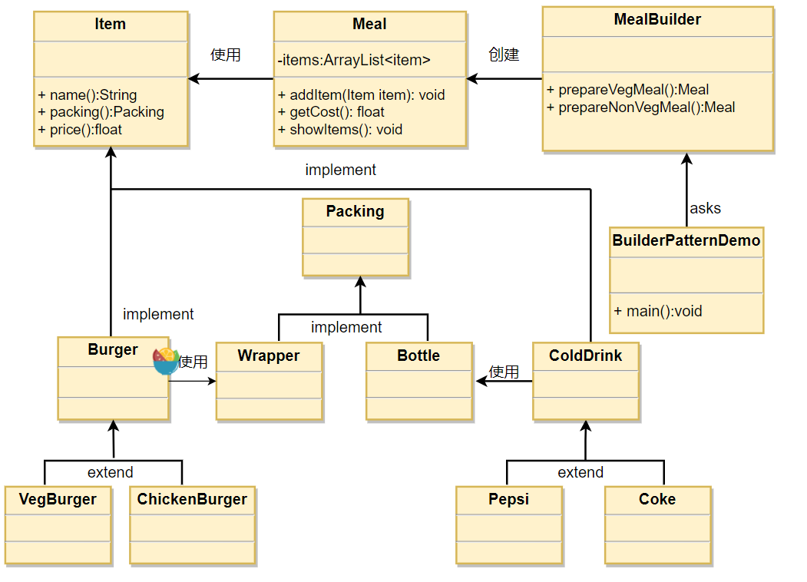

# 工程简介
> 建造者模式：将一个复杂的构建与其表示相分离，按步骤组装，使得同样的构建过程可以创建不同的表示。     
> 关键代码：建造者：创建和提供实例，导演：管理建造出来的实例的依赖关系。       

应用实例：       
1. 去肯德基，汉堡、可乐、薯条、炸鸡翅等是不变的，而其组合是经常变化的，生成出所谓的"套餐"。 
2. JAVA 中的 StringBuilder。

# 延伸阅读

