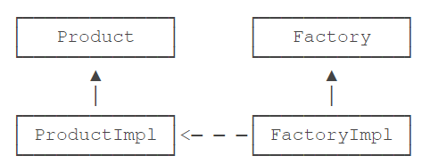

# 工程简介
> 工厂方法：定义一个用于创建对象的接口，让子类决定实例化哪一个类。Factory Method使一个类的实例化延迟到其子类。

工厂方法即Factory Method，是一种对象创建型模式。     
工厂方法的目的是使得创建对象和使用对象是分离的，并且客户端总是引用抽象工厂和抽象产品：     


```java
public interface NumberFactory {
    // 创建方法:
    Number parse(String s);

    // 获取工厂实例:
    static NumberFactory getFactory() {
        return impl;
    }

    static NumberFactory impl = new NumberFactoryImpl();
}
```

## 静态工厂
```java
public class NumberFactory {
    public static Number parse(String s) {
        return new BigDecimal(s);
    }
}
```

## Java标准库中的静态工厂
```java
public final class Integer {
    public static Integer valueOf(int i) {
        if (i >= IntegerCache.low && i <= IntegerCache.high)
            return IntegerCache.cache[i + (-IntegerCache.low)];
        return new Integer(i);
    }
    public static void main(String[] args) {
        Integer n = Integer.valueOf(100);
    }
}
```

##小结
- 工厂方法是指定义工厂接口和产品接口，但如何创建实际工厂和实际产品被推迟到子类实现，从而使调用方只和抽象工厂与抽象产品打交道。
- 实际更常用的是更简单的静态工厂方法，它允许工厂内部对创建产品进行优化。
- 调用方尽量持有接口或抽象类，避免持有具体类型的子类，以便工厂方法能随时切换不同的子类返回，却不影响调用方代码。
# 延伸阅读 
[菜鸟教程-工厂模式](https://www.runoob.com/design-pattern/factory-pattern.html)

