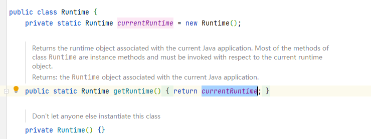

# 工程简介
> 单例模式 ：保证一个类只有一个实例，并提供全局访问点
> 
> 双端检查 http://www.cs.umd.edu/~pugh/java/memoryModel/DoubleCheckedLocking.html

 单例模式目的是保证某个进程中，某个类仅有一个实例
 类只有一个实例，那么就不能以 `new` 的形式创建，单例的构造方法必须是`private`，防止了调用方自己创建实例。
 类的内部可使用静态变量引用唯一创建的实例

## 单例模式
+ 只有private构造方法，确保外部无法实例化；
+ 通过private static变量持有唯一实例，保证全局唯一性；
+ 通过public static方法返回此唯一实例，使外部调用方能获取到实例。

```java
public class Singleton {

    //静态变量创建唯一实例
    private static final Singleton INSTANCE = new Singleton();
    //私有构造器，确保外部无法实例化
    private Singleton() { }
    //全局访问点
    public static Singleton getInstance() {
        return INSTANCE;
    }
}
```
## Java标准库中的单例


## 可以使用枚举类来实现单例
```java
public enum EnumSingleton {

 INSTANCE;

 private String name = "EnumSingleton";

 public String getName() {
  return this.name;
 }

 public void setName(String name) {
  this.name = name;
 }
}

```
> 不建议使用懒加载（由于Java内存模型的原因会导致一些问题）

## 小结
        Singleton模式是为了保证一个程序的运行期间，某个类有且只有一个全局唯一实例；

        Singleton模式既可以严格实现，也可以以约定的方式把普通类视作单例
-- --
##  延伸阅读

 - [廖雪峰-单例模式](https://www.liaoxuefeng.com/wiki/1252599548343744/1281319214514210)
 - [双端检查]( http://www.cs.umd.edu/~pugh/java/memoryModel/DoubleCheckedLocking.html)

